# M5AtomLiteCrtDrumの作り方（完全内蔵メモリ版）

## 概要
M5Stack Atom Lite、ブラウン管テレビ、コイルピックアップを使用した「簡単ブラウン管ドラム」の製作方法です。

ブラウン管への映像信号は、M5Stack Atom Lite と M5UnitRCA を使って生成しています。
本バージョンは**SDカードを一切使用せず、本体の内蔵フラッシュメモリを極限まで活用して動画データを内蔵させた改良版**です。接触不良などの心配がなく、電源を入れて即座に安定した演奏・動作が始まります。

## 🛠️ 主な特徴・機能

### 🎯 演奏・操作の機能
- **お気に入りのパターンですぐに起動**
  - 最後に選択していたファイル番号を自動で記憶するため、本体の電源を入れるだけで、いつも使っているパターンからすぐに表示・演奏できます。
- **ボタン1つでのシンプルなファイル選択**
  - ボタン長押しで演奏パターンをスムーズに切り替えられます（ボタンを離したときに選択番号が保存されます）。
  - 起動時にボタンを押しっぱなしにすることで、保存された番号を無視して先頭のファイルからスタートさせることも可能です。
- **ブラウン管映像出力とLEDの連動**
  - M5UnitRCA を使用し、ブラウン管テレビへ NTSC_J 映像を出力します。
  - 現在表示している映像のピクセルの色に合わせて、本体のLEDの色がリアルタイムに更新されます。

### ⚙️ 内部システムの特徴（開発・設計仕様）
- **SDカード不要の完全内蔵ストレージ駆動**
  - 高速・堅牢なファイルシステム「LittleFS」を採用し、全33個の演奏データ（.binファイル）をすべてAtom Liteの内蔵フラッシュメモリに格納して再生します。SDカードの接触不良や紛失の心配がありません。
- **可変フレームレート（VFR）とループ数の最適化**
  - ほぼ静止している画像は少ない枚数（30フレーム）、動きのある画像には多い枚数（165フレーム/約5.5秒分）を割り当て、限られた内蔵メモリ容量の中でアニメーションの表現力を極限まで高めています。

## 🕹️ ボタン操作方法

ATOM Lite本体のボタン1つで、ファイルの切り替えや状態のリセットが簡単に行えます。ボタンを離した（リリースした）タイミングで、最終的に選択されたファイル番号とメモリの状態が自動で保存されます。

| 操作方法 | 動作内容 |
| :--- | :--- |
| **1クリック** | 現在選択されているファイル番号が画面に表示されます。 |
| **長押し（200ms以上）** | ファイル番号が「1つ」進みます。 |
| **長押しし続ける** | 一定間隔でファイル番号が連続してどんどん増えていきます。 |

> 💡 **起動時の特殊操作（ファイル先頭からの開始）**
> 起動時（電源を入れた瞬間）にボタンを押しっぱなしにしておくことで、前回保存されたファイル番号を無視して、一番先頭のファイル（0番）から強制的にスタートさせることができます。
> （誤作動防止のため、起動直後にボタンを一度離してから、通常のボタン操作が有効になります。）

## 部品

### 1. 表示・制御ユニット
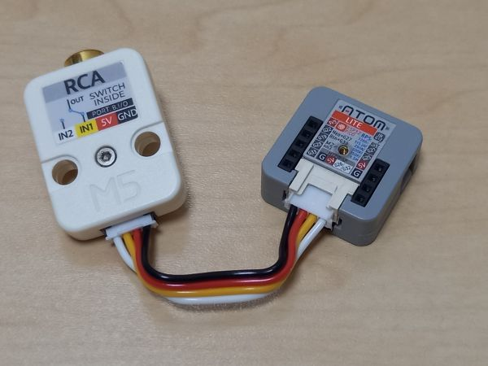

- **制御ユニット**：ATOM Lite
  - （購入先：[スイッチサイエンス](https://ssci.to)）
- **映像出力ユニット**：M5Stack用 RCAコンポジットユニット
  - （購入先：[スイッチサイエンス](https://ssci.to)）

### 2. コイルピックアップ（センサー）ユニット
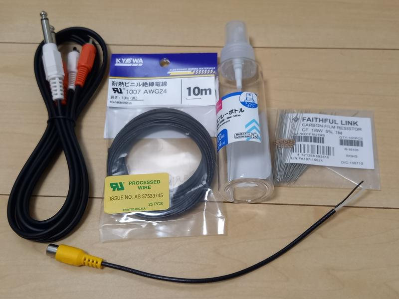

- **コイル用電線**：AWG24 耐熱ビニル絶縁電線（黒）
  - （参考：[Amazon | 協和ハーモネット](https://amazon.co.jp)）
- **コイルの芯**：直径3〜3.5cm程度の筒（スプレーボトルの空き容器などを流用）
- **RCAソケット**：RCA ソケット ケーブル付 DIY用
  - （参考：[Amazon | RCAソケット](https://amazon.co.jp)）
- **電子部品**：抵抗（100kΩ 〜 1MΩ） ×1
- **出力用ケーブル**：RCAピンプラグ - φ6.3mm 標準プラグ 変換ケーブル ×1
  - （参考：[Amazon | F-Factory C-097](https://amazon.co.jp)）

### 3. 周辺機器・その他
- **ノイズ対策機材**：Rowin ノイズリダクション NOISE GATE LEF-319
  - コイル特有の待機ノイズをカットするために使用します。
  - （参考：[Amazon | Rowin](https://amazon.co.jp)）
- **ディスプレイ**：NTSC（RCA）入力対応のブラウン管テレビ ×1
- **音響機器**：アンプ内蔵スピーカー（またはミキサー＋アンプ環境など） ×1

## 作製手順

### 1. 制御ユニットの準備
ATOM Lite本体に、PlatformIOのプログラムを書き込みます。  
M5UnitRCAを介してブラウン管テレビに接続し、映像が出ることを確認します。

### 2. ピックアップ（センサー）ユニットの作り方

#### ① 筒の加工
直径3.5cmのスプレーボトルなどの筒を、長さ3.5cmに切り出します。  
（10m分のリード線を巻くのに最適なサイズになります）
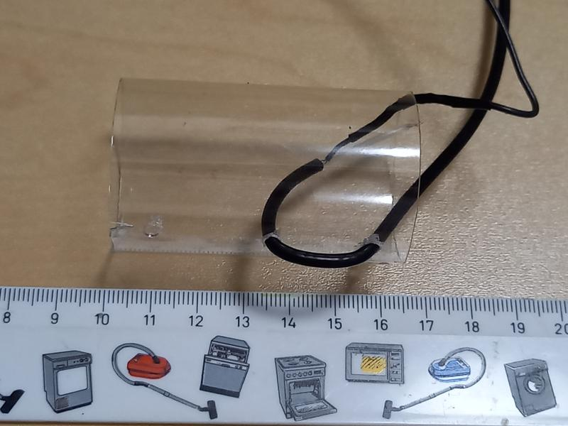

#### ② RCAジャックの固定
RCAジャック付きケーブルを、切り出した筒へ固定します。
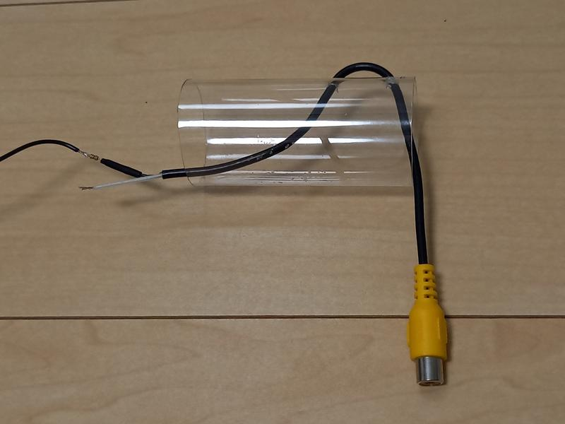

#### ③ 抵抗のはんだ付け
GND（グランド）側に、ノイズ対策・インピーダンス調整用の抵抗（100kΩ〜1MΩ）をはんだ付けします。
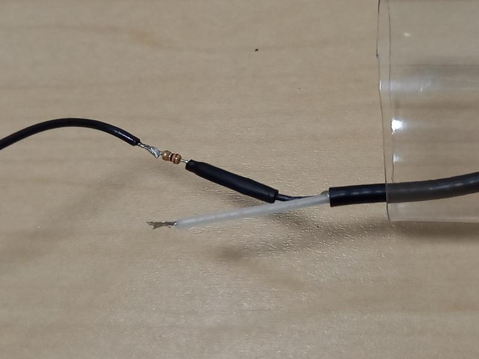

#### ④ 絶縁処理
はんだ付けした部分を、熱収縮チューブなどを使って綺麗に絶縁処理します。
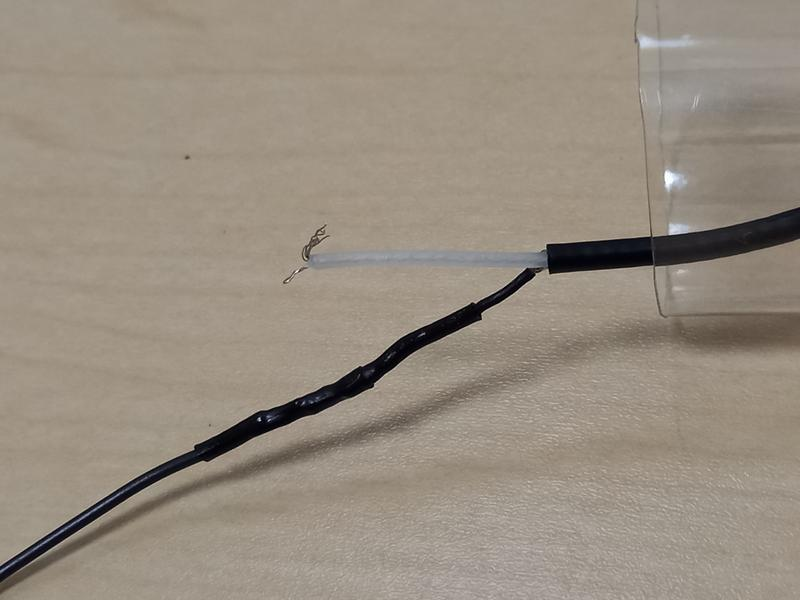

#### ⑤ コイルの巻き付けとはんだ付け
リード線（10m）を筒にぐるぐると巻き付けていきます。巻き終わって元の位置に戻ったら、線の端をRCAの中心（シグナル）側にはんだ付けします。
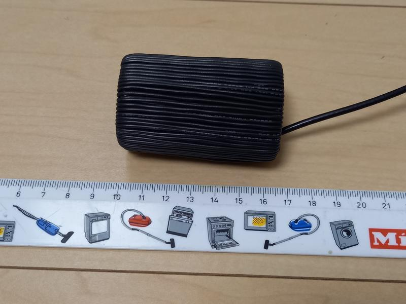

> 💡 **ポイント（感度調整）**
> 接続するアンプやブラウン管の環境に合わせて後から抵抗値を変更（調整）できるように、抵抗を交換しやすい状態にしておくのがおすすめです。
> 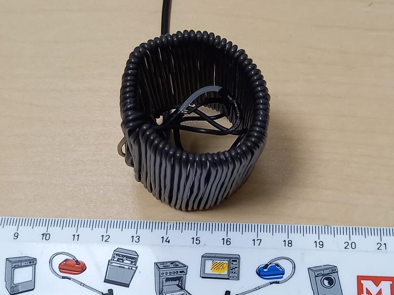
> 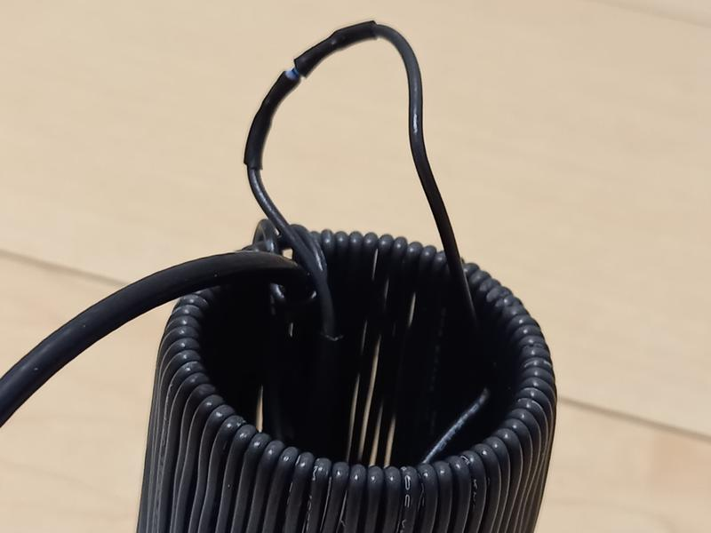

#### ⑥ ピックアップの完成
これで自作のコイルピックアップユニットは完成です。
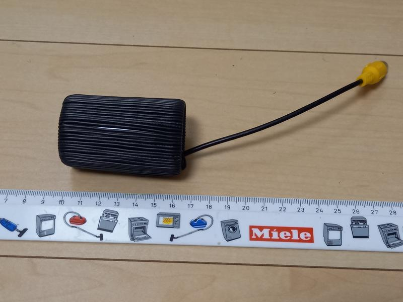

### 3. 全体組み立て・動作確認

#### ① 表示ユニットの接続と起動確認
ATOM Lite本体に、PlatformIOのプログラムを書き込みます。M5UnitRCAを介してブラウン管テレビのRCA（黄色）端子へ接続し、正常に映像が表示されるか確認します。
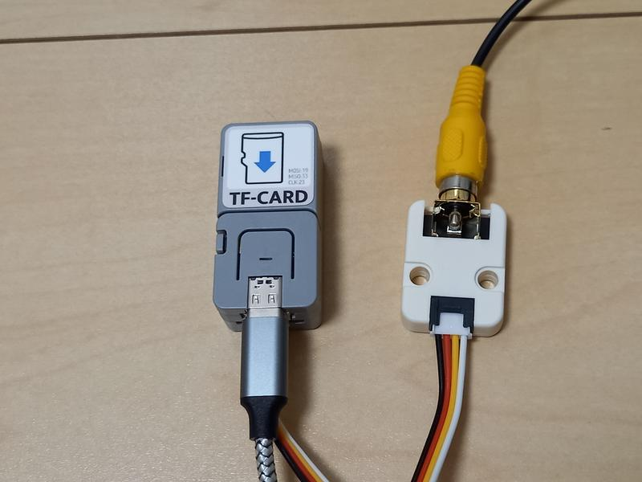
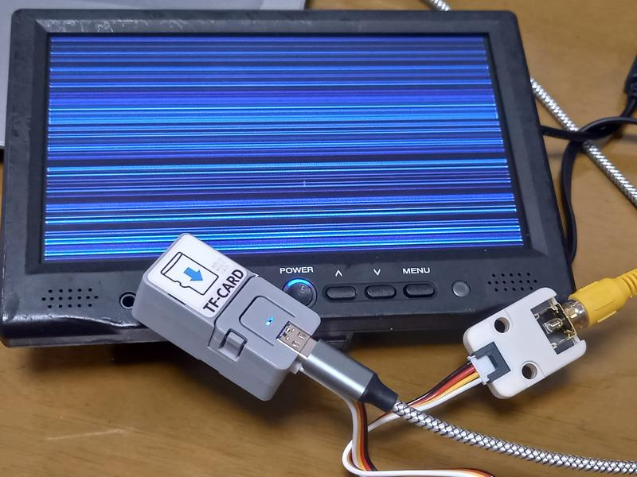

#### ② オーディオ系統の接続
作成したコイルピックアップを **Rowin NOISE GATE** のインプットに接続します。
ノイズゲートのアウトプットから、変換ケーブル（RCA - 6.3mm標準）を使用してアンプ内蔵スピーカーやミキサー環境へ接続します。
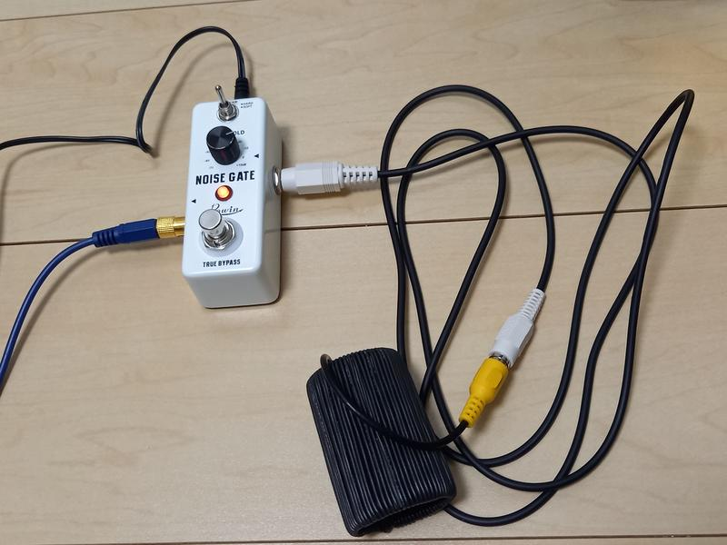

#### ③ 演奏方法とノイズ調整
1. ブラウン管テレビ、ATOM Lite、スピーカー、エフェクターすべての電源を入れます。
2. **演奏方法**：自作したコイルピックアップを**左手でしっかりと握り、右手の手のひらでブラウン管の表面をパタパタとたたいて演奏します。**
3. 演奏していない時の「ジー」という待機ノイズが完全に消え、ブラウン管の表面を手でたたいた瞬間に、画面の明暗（パターン）に応じたドラムサウンドが気持ちよく鳴るように、ノイズゲートのしきい値（Threshold）を微調整してください。

#### 💡 トラブルシューティング：感度とノイズの調整

ノイズゲートの設定（しきい値の調整）だけで上手く動作しない（音が途切れる、またはノイズが消えない）場合は、**ピックアップに仕込んだ抵抗の値を変更してみる**のが効果的です。

- **抵抗値を高くする（例: 1MΩに近づける）**：
  - センサーの感度が高くなり、弱い叩き方でも音が鳴りやすくなります。ただし、同時にノイズも拾いやすくなるため注意が必要です。
- **抵抗値を低くする（例: 100kΩに近づける）**：
  - 全体的なノイズを抑えることができますが、音を鳴らすためにより強くブラウン管を叩く必要があります。

> ⚠️ **ブラウン管の大きさによる違い**
> 使用するブラウン管テレビの画面サイズによって、発生する電磁波の強さが異なります。テレビの大きさに合わせて、ちょうど良いバランスになる抵抗値（100kΩ〜1MΩの間）を探してみてください。

## 💾 内蔵ストレージ仕様（SDカードレス版）について

本バージョンはSDカードを一切使用せず、M5Atom Liteの内蔵フラッシュメモリ（4MB）を極限まで活用して動画データを完全に内蔵させた改良版です。
ほぼ静止している画像を少ないフレーム数（30F）、動く画像を多いフレーム数（165F）に割り当てる「可変フレームレート（VFR）」を採用し、ファイルサイズから自動でループフレーム数を計算するロジックを搭載しています。

### 1. 内蔵フラッシュメモリ配分（メモリマップ）
無線アップデート（OTA）の予備領域を完全に削除し、ファイルシステム（LittleFS）領域を通常の2倍以上に増やしています。

| 領域名 (Name) | サイズ | 役割 / ステータス |
| :--- | :--- | :--- |
| **nvs** | 20 KB | `Preferences`による前回再生ファイル番号の記憶エリア |
| **otadata** | 8 KB | システム管理領域 |
| **app0** | 768 KB | プログラム本体領域（使用率：約69.1% / 空き：約238KB） |
| **spiffs** | 3,200 KB (3.125 MB) | **LittleFS（動画データ専用領域）** ・静止画（30F）× 17本 ・動画（165F）× 16本 合計33個の `.bin` ファイルをほぼ100%満タンで格納 |

---

### 📦 ディレクトリ構造とデータ準備

本リポジトリの `/SD` フォルダには、元データおよびカスタマイズ用のツールが同梱されています。

- **`/SD` フォルダの中身**
  - `*BIN565_900.dat` : SDカード版で使用していたオリジナルの900フレーム分の動画・静止画データ（元データ）
  - `trim_frames.py` : 元データから必要なフレーム数（30F / 165F）を自動で切り出して、LittleFS転送用のファイルを生成するPythonスクリプト

#### 🔧 独自に枚数を変更・調整したい場合
もし動画の長さ（フレーム数）をさらに調整したい場合は、以下の手順で自由に再生成が可能です。
1. `/SD` フォルダ内で `trim_frames.py` を実行します。
2. スクリプトと同じ階層に、指定フレーム数でトリミングされた33個の `.bin` ファイルが入った `data` フォルダが自動生成されます。
3. 生成された `data` フォルダを、プロジェクトのルート直下（`platformio.ini` と同じ階層）に配置（上書き）します。

---

### 🚀 LittleFSデータへの書き込み方法（2ステップ）

内蔵ストレージへの書き込みは、**「①動画データの書き込み」**と**「②プログラムの書き込み」**の2段階の手順が必要です。

#### 準備
PC側でトリミングした33個の `.bin` ファイルを入れた `data` フォルダを、`platformio.ini` と同じ階層（プロジェクトのルート直下）に配置します。

#### ステップ1：動画データ（LittleFSイメージ）の書き込み
1. VS Codeの左端にある **「PlatformIO（蟻のマーク）」** のアイコンをクリックします。
2. 開いたメニューから、`PROJECT TASKS` ＞ `m5stack-atom` ＞ **`Platform`** を展開します。
3. その中にある **`Upload Filesystem Image`** をクリックして実行します。
4. ターミナルで `[SUCCESS]` と表示されれば、内蔵ストレージへのデータ転送は完了です（約3.1MB of の転送に30秒〜1分ほどかかります）。

#### ステップ2：プログラムの書き込み
1. 通常通り、VS Codeの一番下（ステータスバー）にある **`→` ボタン（PlatformIO: Upload）** をクリックします。
2. コンパイルが走り、プログラム本体がAtom Liteに書き込まれます。

> ⚠️ **注意**
> 動画データを更新・変更した場合は、必ず**ステップ1（Upload Filesystem Image）**を再実行してください。通常のプログラム書き込み（ステップ2）だけでは内蔵の動画データは更新されません。

### 💡 コイルピックアップに関する補足

ブラウン管の描画による電界の変化を「コイルピックアップ」と呼ぶセンサで拾っています。「コイル」という名称を用いていますが、インダクタンスなどの**電気的な「コイルとしての特性（電磁誘導など）」は必要としていません。**

ここでコイル形状を採用している理由は、**「人間の身体」と「ある程度の表面積を持った導体」が近づくことで発生する静電容量の変化を検知する上で、その構造が最も実用的かつ便利だったため**です。

具体的には、一般的な配線材料（導線や被覆線）を巻き付けることで、以下の工作上のメリットを生み出しています。

- **優れた加工性**：はんだ付けが非常に容易であること。
- **高い汎用性**：巻き付ける回数や形を工夫することで、筐体のサイズに合わせてセンサーの形状を自由に変更・調整できること。

そのため、必ずしも**線を巻き付ける必要すらありません。**
仕組みとしては**「静電容量タッチセンサーの電極」そのもの**であるため、十分な面積を持った金属板や導電テープなど、はんだ付けができて手が近づくことを検知できる導体であれば、どのような形状のものでも全く同様に動作します。

## License
[MIT License](LICENSE)